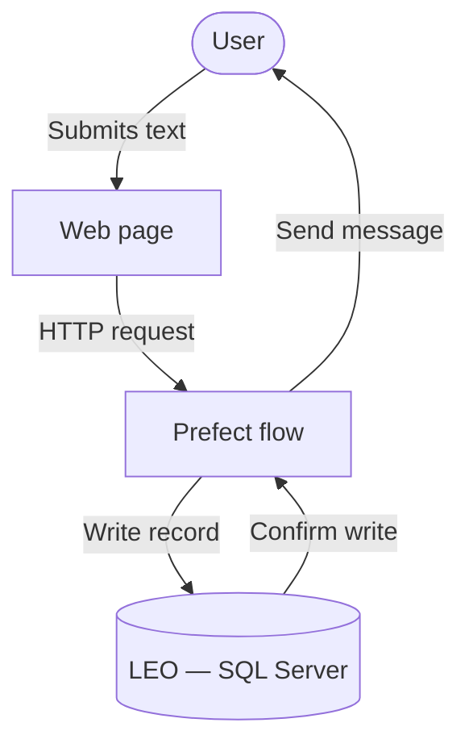

# Diagrams

Flow diagrams and data model visuals for this project.

Use Mermaid inside `.md` files. Diagrams live in version control alongside the code, and render natively in Azure DevOps.

VS Code: install Markdown Preview Enhanced. Set `"markdown-preview-enhanced.mermaidTheme": "dark"` in `settings.json` if on a dark theme.

Name files to match what they show: `main_flow.md`, `data_model.md`, etc.

## Shape conventions

| Shape | Mermaid syntax | Means |
|---|---|---|
| Rectangle | `[Label]` | Process or step |
| Stadium | `([Label])` | Person or external actor |
| Diamond | `{Label}` | Decision |
| Cylinder | `[(Label)]` | Database or data store |
| Rounded rectangle | `(Label)` | Start or end |
| Parallelogram | `[/Label/]` | Input or output |

## Example

